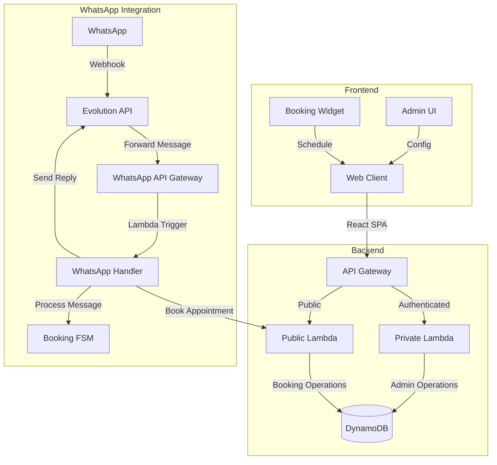

# Barber App - Multi-tenant Booking Platform

A serverless booking platform for barber shops and service businesses with WhatsApp integration.

## Architecture Overview



## Key Components

### Frontend

- **React Application**: Built with React, Material UI, and Chakra UI
- **Multi-tenant Support**: Serves different configurations for different businesses
- **Booking Calendar**: Integration with DevExpress scheduler and FullCalendar
- **Chat Interface**: AI-powered booking assistant
- **Admin Panel**: Configuration management for shop owners

### Backend

- **Serverless Architecture**: AWS SAM with Lambda functions
- **API Gateway**: Separate endpoints for authenticated and public access
- **DynamoDB**: NoSQL database for appointments, workers, and configurations
- **Cognito Authentication**: User management and JWT-based access control

### WhatsApp Integration

- **Evolution API**: WhatsApp Business API integration
- **Serverless Handlers**: Lambda functions for processing WhatsApp messages
- **Text-based Numbered Options**: Adaptation for non-button interface
- **Finite State Machine (FSM)**: Manages conversation flow

## WhatsApp Integration Details

The WhatsApp integration provides a text-based booking experience using numbered options since Evolution API doesn't support clickable buttons.

### How It Works

1. **Text-based Numbered Options**: Options presented as a numbered list
2. **Number-to-Option Translation**: User's numeric responses (e.g., "1") are translated to the corresponding option text
3. **FSM Compatibility**: Translation happens before processing to maintain FSM compatibility

### Example Conversation Flow

**Service Selection:**
```
Bot: Olá João! Qual serviço você gostaria de agendar?

1. Corte de cabelo
2. Barba
3. Corte e barba
4. Sobrancelha
5. Hidratação

User: 1

[System translates "1" to "Corte de cabelo"]
```

**Worker Selection:**
```
Bot: Qual profissional você prefere para o serviço de Corte de cabelo?

1. Carlos
2. Marcelo
3. Roberto

User: 2

[System translates "2" to "Marcelo"]
```

**Confirmation:**
```
Bot: Para confirmar: Corte de cabelo com Marcelo em 2025-05-15 às 14:30. Está correto?

1. Sim
2. Não

User: 1

[System translates "1" to "sim"]
```

### Implementation Components

1. **NumberedOptions Utility**:
   - Formats replies with numbered options based on the conversation state
   - Processes numeric input to convert to text options
   - Available in both JavaScript and Python

2. **Context Management**:
   - Maintains conversation state for each user
   - Uses key format: `{shopId}:{phoneNumber}`
   - Includes TTL to expire old contexts

3. **Webhook Handler**:
   - Processes incoming WhatsApp messages
   - Formats replies with numbered options
   - Routes appointments to the booking system

## Configuration System

The application uses a multi-level configuration approach:

1. **Default configuration**: Base settings for all accounts
2. **Account-type configuration**: Settings specific to individual or enterprise accounts
3. **Shop-specific configuration**: Custom settings for each tenant

Configuration is stored in:
- LocalStorage (client-side persistence)
- DynamoDB (server-side persistence)

## Booking System

The booking system uses a finite state machine (FSM) to manage the conversation flow:

1. **Step 0**: Initial greeting
2. **Step 1**: Collect client name
3. **Step 2**: Service selection
4. **Step 3**: Worker selection (enterprise accounts only)
5. **Step 4**: Date selection
6. **Step 5**: Time selection
7. **Step 6**: Confirmation

## Deployment

The application uses AWS SAM for serverless deployment:

- **template.yaml**: Defines all AWS resources
- **API Gateway**: HTTPS endpoints
- **Lambda**: Serverless functions
- **DynamoDB**: NoSQL database
- **Cognito**: Authentication

## Security Notes

1. **API Keys**: Used for public endpoint authentication
2. **JWT Tokens**: Used for private endpoint authentication
3. **CORS Configuration**: Controls access to APIs
4. **Environment Variables**: Store sensitive configuration

## Development Guidelines

1. **Environment Setup**:
   - Use `.env` files for local development
   - Configure AWS credentials for deployment

2. **Testing**:
   - Unit tests for FSM logic
   - Integration tests for API endpoints

3. **Code Standards**:
   - Use consistent error handling patterns
   - Follow standard naming conventions
   - Add proper documentation and comments